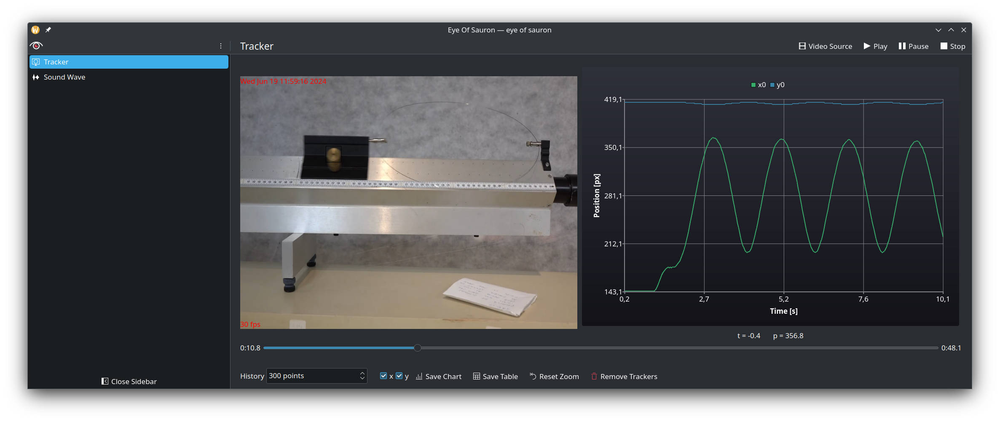
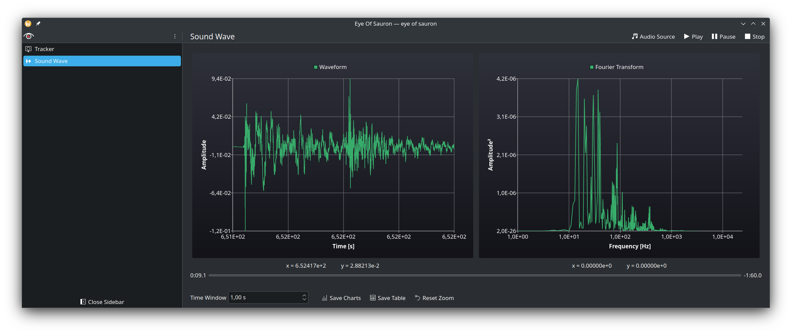

# Eye of Sauron

Using webcams and Middle-earth's power in your Physics classes

## Using the Tracker

- Use the mouses left button to draw a rectangle around the arget area. This will create a tracker instance for it.